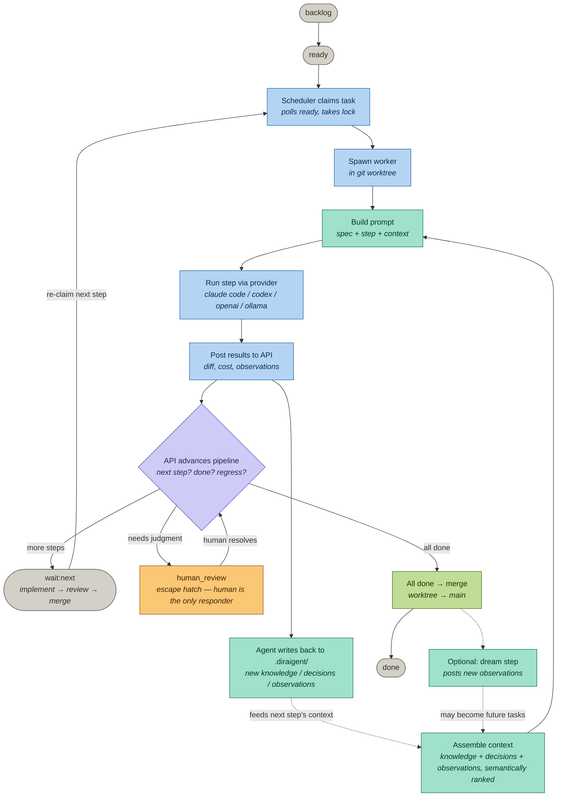

# How Diraigent works today — coding job flow

An overview of how a coding job moves through Diraigent as it currently exists, including how knowledge, decisions, and observations feed each step. This describes the **current** system (no modifications).

> Grounded in the repo source (`main`, read 2026-05-24): `apps/orchestra/src/engine/{scheduler,pipeline,worker,context,prompt}.rs`, `libs/common-rust/diraigent-types/src/state_machine.rs`, and `.diraigent/` repo files.

---

## The flow at a glance

Legend: gray = task state · blue = orchestra action · teal = context/knowledge · purple = decision point · amber = human · green = git result.

---

## How it actually works

### 1. A task starts as a unit of work

Every job is a **task** carrying structured fields: `spec`, `files`, `notes`, `acceptance_criteria`, and a reference to a **playbook**. Tasks begin in `backlog` or `ready`. A playbook is a multi-step workflow — the default `standard` playbook is `implement → review → merge`. Playbooks live as YAML files in `.diraigent/playbooks/` in the repo (the playbook database table was removed; the files are now the source of truth).

### 2. The scheduler claims ready tasks

The orchestra polls for `ready` tasks and claims one by taking a lock (file-scope locks prevent two workers fighting over the same files). Diraigent runs several workers concurrently — each in its own isolated **git worktree**, so parallel tasks never collide on the working tree.

### 3. Context is assembled and injected

Before the agent runs, the orchestra assembles context for the task: relevant **knowledge** (architecture docs, conventions, patterns), **decisions** (ADR-style records), and **observations** (things prior agents noticed). When a specific task is in play, the API ranks these **semantically via embeddings** so the most relevant context surfaces first. This blob plus the task `spec` and the current step's instructions become the prompt.

### 4. The step runs via a provider

The worker spawns the chosen provider — Claude Code, Codex/Copilot, OpenAI, or Ollama — with the step's profile. The profile is derived from the step name: `implement`-type steps get the full toolset, `review` steps are read-only, `merge` steps get git-only access. The step has a budget (in dollars) and an optional model override.

### 5. Results post back, and the agent writes to repo memory

When the step finishes, the worker posts results to the API: the diff, cost/turn metrics, and any observations. Crucially, the agent can also **write new knowledge, decisions, and observations into `.diraigent/`** as it works. This is the compounding loop — what one step learns becomes context for the next step and for future tasks.

### 6. The API advances the pipeline

This is the key control point: **the API owns transitions, not the orchestra.** After a step, the orchestra's `check_next_step` only distinguishes three outcomes:

- task went back to `ready` → a review rejection regressed it, re-run the prior step
- task reached `done` → all steps complete, trigger merge to main
- task is in `human_review` → a human has it, do nothing

The actual "advance vs regress vs done" decision happens atomically in the API's `transition_task`, validated against the shared state machine.

### 7. Human review is the only escape today

If something needs human judgment — ambiguity, a rejection that can't be auto-handled — the task lands in `human_review`. **A human is the sole responder.** There is no AI-answering step in the current system; the task waits until a person resolves it. (This is the gap an AI-responder stage would fill.)

### 8. Merge, and optionally dream

When every step is done, the work merges from the worktree into main via the configured git strategy. Playbooks like `dreamer` add a final `dream` step that explores the codebase around the finished work and posts new **observations** — candidate follow-up tasks — so the project generates its own next work.

---

## Why it's a "factory," not just a runner

The defining property is the **compounding context loop**. Each step's output — the diff plus written-back knowledge/decisions/observations — becomes the next step's input. Observations from review or dream steps re-enter as tasks. Over time the project accumulates its own memory, so later work starts informed by everything earlier work learned. That feedback loop (the dashed lines in the diagram) is what separates Diraigent from a stateless task runner.

---

## The current limitation

The only responder for a stuck task is a human (`human_review`). For long, unattended runs this means the job halts on the first decision it can't make autonomously and waits for a person. An AI-first responder stage — answer with an AI, escalate to a human only when the answer isn't trusted — is the natural next addition, and it slots in directly where `human_review` sits today.
