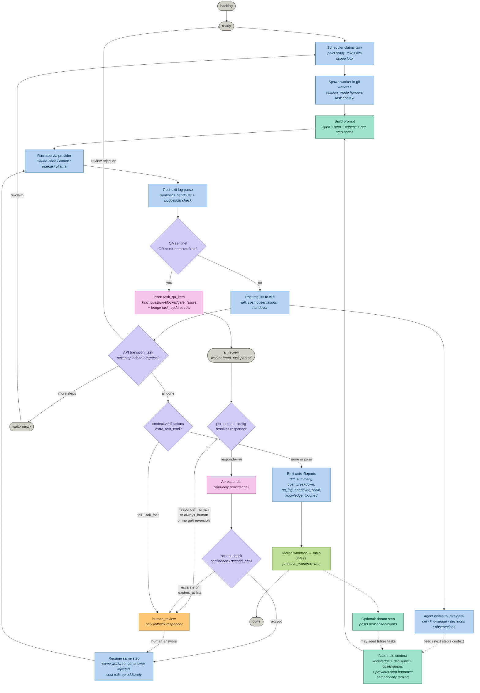
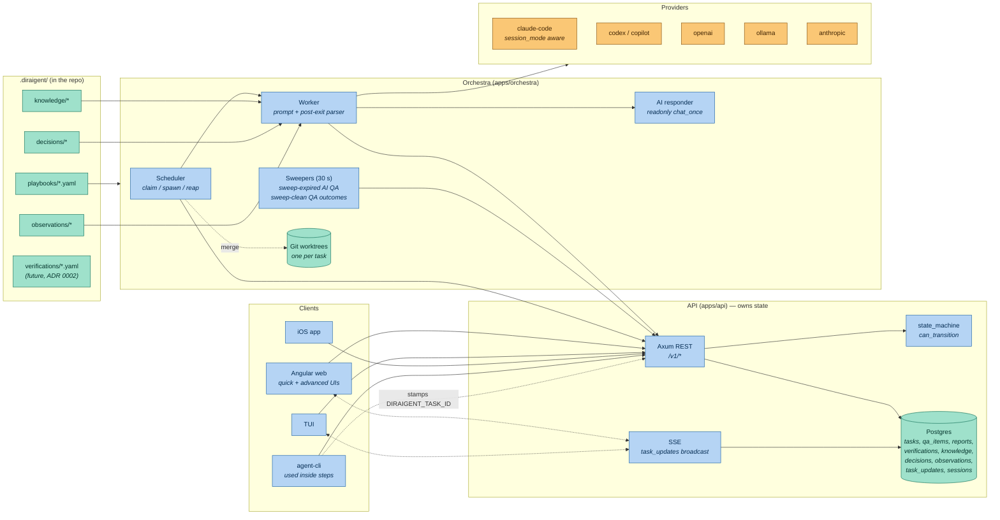

# Diraigent — system overview (current state)

How a coding job moves through Diraigent **today**, including everything the
IMPROVEMENT.md programme (SoW-1 → SoW-4 + SoW-8) added on top of the original
human-only review loop.

> Grounded in `main` as of 2026-05-24. Source-of-truth files cited inline. The
> prior version of this doc described the pre-SoW factory; that file is kept at
> [diraigent-overview.md.bak](diraigent-overview.md.bak) for diff context.

---

## 1. The flow at a glance



Legend: gray = task state · blue = orchestra action · teal = context/knowledge ·
purple = decision point · pink = AI-responder loop (new) · amber = human ·
green = git result.

---

## 2. Architecture (processes and stores)



**Key invariants**

- **API owns state.** The orchestra never writes the next step name — it
  posts results and the API's `transition_task` validates against the shared
  `state_machine`.
- **Playbooks are files**, not rows. `.diraigent/playbooks/*.yaml` is the
  source of truth post-migration 046; each step is a `serde_json::Value`, so
  new per-step keys (`qa:`, `stuck_detector:`) need **no schema change**.
- **Worktrees are reused** within a task across re-runs (worker exits don't
  recycle the worktree). Cleanup gated on
  `task.context.preserve_worktree`.

---

## 3. Surface map — what each nav view does

Source of truth: [navigation.json](navigation.json) +
[apps/web/src/app/app.routes.ts](apps/web/src/app/app.routes.ts).

| Nav view | Path | Purpose | Backed by |
|---|---|---|---|
| **Work** | `/work` | Tasks needing your attention (pending QA, blockers, ready-for-review). Replaces the old single-list inbox. | `task_updates` + `task_qa_item` |
| **Tasks** | `/quick`, `/advanced`, `/quick/:id`, `/advanced/:id` | Per-task detail. `/quick` = single-form create + live QA panel. `/advanced` = full overrides, resolved-config preview, every panel. | `tasks`, `task_updates`, `task_qa_item`, `reports` |
| **Review Queue** | `/review` | Pending QAs grouped by *Needs you* / *AI is answering* / *Waiting on others*. | `task_qa_item WHERE status IN (pending, escalated)` |
| **Dashboard** | `/dashboard` | KPIs + recent activity. Default landing for `uiMode='advanced'`. | aggregates |
| **Agents** | `/agents` | Live worker activity, task queue, claim/release. | orchestra runtime |
| **Playbooks** | `/playbooks` | The agent workflows themselves (`implement → review → merge`, `dreamer`, etc.). Edit YAML in browser. | `.diraigent/playbooks/*.yaml` |
| **Step Templates** | `/step-templates` | Reusable per-step config blocks composed into playbooks. | `step_template` (mig 015–016) |
| **Pipelines** | `/pipelines`, `/pipelines/:runId` | **CI** pipeline runs (GitHub Actions / Forgejo). Separate from playbooks. | external CI API |
| **Knowledge** | `/knowledge` | Long-lived facts written into `.diraigent/knowledge/`. Filterable by `task_id` (gap #1, gap #4). | `knowledge` |
| **Decisions** | `/decisions` | ADR-style records, accept/reject/deprecate/supersede. | `decisions` |
| **Observations** | `/observations` | Things prior agents noticed; promote → new task. | `observations` |
| **Reports** | `/reports` | Researcher reports **plus** auto-reports emitted on task completion (`diff_summary`, `cost_breakdown`, `qa_log`, `handover_chain`, `knowledge_touched`). Filter by `source = researcher \| auto`. | `report` (mig 050) |
| **Verifications** | `/verifications` | Per-task verification outcomes (test runs, gates). Filter by kind / status. | `verification` table |
| **Goals** | `/goals` | Higher-level objectives that group tasks. | `goal` |
| **Team** | `/team` | Tenant members. | `tenant_member` |
| **Source** | `/source` | Code browser (read-only). | repo on disk |
| **Git** | `/git` | Worktree status, push, PR. | git porcelain |
| **Search** | `/search` | Cross-entity full-text. | embeddings + Postgres FTS |
| **Chat** | `/chat` | Free-form chat against project context. | provider |
| **Logs** | `/logs` | Per-task structured logs. | per-task log file |
| **Audit** | `/audit` | Tenant audit trail; includes QA lifecycle events (created, AI-answered, escalated, resolved). | `audit` (mig 010) |
| **Events** | `/events` | Raw `task_updates` feed with kind filter. | `task_updates` |
| **Integrations** | `/integrations` | OAuth + API-key integrations (GitHub, Forgejo, …). | `integration` |
| **Webhooks** | `/webhooks` | Outbound delivery config + delivery log. | `webhook`, `webhook_delivery` |
| **Settings** / **Tenant Settings** | `/settings`, `/tenant-settings` | Per-user theme/locale, per-tenant defaults. | `tenant_theme_preferences` (mig 007) |

### What you asked about specifically

| You said | Where it lives |
|---|---|
| **Project** | No top-level page — projects are a scope dimension. Switch with `[` / `]`, or pick on `/quick/new` and `/advanced/new`. Project settings are under tenant settings. |
| **Job** | Same surface as **Tasks**. The terms are used interchangeably. |
| **References** | The *Reference* nav group — Knowledge + Decisions + Reports + Verifications. Not a single page. |
| **Pipelines** | Two different things in the product, both shipped: `/playbooks` (agent step pipelines) and `/pipelines` (CI runs). |

### Key things **not** present yet (honest gaps)

- **No "Project" landing page** — the project switcher is global but no
  `/projects/:id` overview exists. Tasks/Knowledge/Decisions all scope to
  it implicitly.
- **No QA outcome dashboard** — SoW-4 stamps `task_qa_item.outcome`
  (`resolved_clean | resolved_reverted | resolved_followup | unknown`) but
  no UI surfaces it yet. Telemetry-first, by design.
- **No verifications manifest UI** — ADR 0002 defers the
  `.diraigent/verifications/*.yaml` library; today only the inline
  `extra_test_cmd` Tier 1 is wired.
- **No mid-stream agent control channel** — sentinel parsing is post-exit
  only. MCP `ask` tool was explicitly deferred (SoW-6, Tier 3).
- **No N-of-M responder fan-out** — deferred (SoW-7, Tier 3) until SoW-4
  telemetry justifies the K× cost.

---

## 4. What's new vs what was already there

Comparing **today's `main`** against the pre-IMPROVEMENT.md baseline
(the system described in `diraigent-overview.md.bak`).

| Capability | Before (baseline) | After IMPROVEMENT.md | Same workflow? |
|---|---|---|---|
| **Task lifecycle states** | `backlog \| ready \| done \| cancelled \| wait:<step> \| human_review` | + `ai_review` (parks task while AI responder works) | Yes — new state slots in beside `human_review`, same scheduler arm |
| **Stuck-task handling** | Human-only via `human_review` | AI-first via `ai_review` → `human_review` fallback | Yes — same review queue, AI just answers first |
| **Structured Q/A** | Free-text `blocker` task_updates | Dedicated `task_qa_item` table (kind, prompt, options, responder, status, expires_at, **outcome**) | Yes — bridge `task_updates` row preserves the existing UI thread |
| **Agent signalling** | None — agent could only post observations | `DIRAIGENT_QA[<nonce>]: …` sentinel parsed post-exit. Nonce defeats prompt-injection echo | New — but post-exit only, no mid-stream channel |
| **Cross-step continuity** | Next agent re-derived context from the worktree | `HANDOVER[<nonce>]: …` block parsed and prepended as `## Handover from <step>` | Yes — rides the same sentinel parser, same prompt assembler |
| **QA policy** | n/a | Per-step `qa: { responder, accept, min_confidence, on_irreversible, stuck_detector }` in playbook YAML. Forced `second_pass` for Merge-profile / irreversible steps | New — playbooks already accept arbitrary per-step JSON (mig 046) |
| **AI responder** | n/a | Read-only `chat_once` provider call (claude-code today; other providers return clear "not implemented"). Cost rolls up additively into the task | New — reuses `providers/` |
| **Accept-check** | n/a | `confidence` (self-report ≥ min_confidence) / `second_pass` (two temps agree) / `always_human` / `always_ai` | New |
| **Timeout policy** | n/a | AI QA: `expires_at` (default 5 min) → escalate. **Human QA never auto-cancels.** Sweeper at `POST /v1/qa/sweep-expired`, 30 s tick | New |
| **QA outcome telemetry** | n/a | `task_qa_item.outcome` stamped by revert hook / follow-up hook / clean sweeper. First-decisive-signal wins | New — no UI yet, by design |
| **Stuck detector** | n/a | Post-exit: if `budget ≥ 80%` AND `diff = 0 lines` AND no sentinel, synthesise `gate_failure` QA. Per-step opt-out | New — rides the same QA pipeline |
| **Verifications** | n/a | `task.context.verifications.extra_test_cmd` runs in worktree post-AllDone; records `verification` row with truncated stdout/stderr/exit; `fail_fast=true` blocks merge | New — see ADR 0002 |
| **Auto-Reports on completion** | Researcher reports only | `context.reports: [diff_summary, cost_breakdown, qa_log, handover_chain, knowledge_touched]` emits `source='auto'` rows on AllDone | New — migration 050 added the discriminator |
| **Session mode** | One session per step, always | `task.context.session_mode = shared` keeps Claude Code session across steps (per-task UUID, `--session-id` / `--resume` / `--no-session-persistence`). ADR 0001. Other providers log fallback | New — migration 051 added `task.session_id` |
| **Worktree retention** | Always cleaned post-merge | `task.context.preserve_worktree = true` skips cleanup | New |
| **Pipeline control point** | API owns transitions, orchestra observes | **Unchanged** — every new feature plugs into the same `transition_task` + state-machine bottleneck | ✅ |
| **Knowledge / decisions / observations** | Written by agents into `.diraigent/` | **Unchanged** + new `task_id` query param + `DIRAIGENT_TASK_ID` stamp from `agent-cli` so attribution is reliable | ✅ |
| **Playbooks** | YAML in `.diraigent/playbooks/` | **Unchanged** + new per-step `qa:` / `stuck_detector:` keys (no migration needed) | ✅ |
| **Providers** | claude-code, codex, copilot, openai, ollama, anthropic | **Unchanged** as a set; claude-code gained session-mode + `chat_once` for responder | ✅ |
| **Review queue UI** | Single `human_review` list | Three groups: *Needs you* / *AI is answering* / *Waiting on others*. QA history per task. Live SSE + 4 s poll | Same backend table, richer view |

**Compatibility summary:** every new field is **opt-in via
`task.context.*` or per-step `qa:`**, with safe defaults that reproduce the
old behaviour. An existing playbook with no `qa:` block falls back to
`always_human`, so nothing pre-IMPROVEMENT changes shape unexpectedly.

---

## 5. How a new job flows through the same pipeline

A worked example — a task using **all** the new features — to show that
nothing routes around the pre-existing scheduler/worker/state-machine.

1. **Create.** `POST /v1/tasks` with
   ```jsonc
   {
     "spec": "Add rate limiting to /v1/tasks endpoint",
     "playbook_id": "standard",
     "context": {
       "session_mode": "shared",
       "preserve_worktree": false,
       "reports": ["diff_summary", "cost_breakdown", "qa_log"],
       "verifications": {
         "extra_test_cmd": "cargo test -p diraigent-api rate_limit",
         "fail_fast": true
       }
     }
   }
   ```
   Task lands in `backlog → ready`. Same path as before.
2. **Scheduler claims** (`apps/orchestra/src/engine/scheduler.rs`). Allocates
   worktree + session UUID (per `session_mode=shared`). Same path.
3. **Worker builds prompt** with knowledge/decisions/observations **plus** a
   per-step nonce in the system prompt. Same prompt assembler, one new line.
4. **Provider runs.** During the `implement` step the agent hits an
   ambiguity and emits:
   ```
   DIRAIGENT_QA[7f3a]: Token bucket or sliding window?
   DIRAIGENT_QA_OPTIONS[7f3a]: token_bucket|sliding_window
   DIRAIGENT_QA_END[7f3a]
   ```
5. **Post-exit parser** (in the worker, attached to the same log read the
   provider was already doing) finds the sentinel, validates nonce,
   creates `task_qa_item` + bridge `task_updates` row, transitions task to
   `ai_review`. Worker frees up.
6. **AI responder** (cheap read-only provider call). Step's `qa:` config
   resolves to `accept: confidence, min_confidence: 0.85`. Responder
   returns `{ answer: "token_bucket", confidence: 0.92 }` — accepted.
   `answer_qa_item` writes `status=resolved, outcome=unknown`. State
   transitions `ai_review → <implement>`.
7. **Re-run** in **the same worktree**, `qa_answer` injected via
   `PreviousStepContext`. Provider cost from step #4 + responder + re-run
   all roll up additively into `task.cost_usd` (verified by code review
   per SCOPE.md SoW-2 §Tests).
8. **Subsequent steps** (`review`, `merge`) run normally. `session_mode=shared`
   means Claude Code resumes the same session across all three steps.
9. **AllDone branch.** `extra_test_cmd` runs in the worktree under a
   600 s timeout. Exit 0 → records a `verification` row `status=pass`,
   merge proceeds. (Exit non-zero with `fail_fast=true` would have set
   `verification_blocked_merge`, posted a comment, and transitioned to
   `human_review` — same review queue as any other escalation.)
10. **Auto-reports.** Three `source='auto'` `report` rows emitted
    (`diff_summary`, `cost_breakdown`, `qa_log`). Appear under `/reports`
    next to researcher reports, filterable by source.
11. **Merge** to main via existing git strategy. Worktree cleaned (no
    `preserve_worktree`).
12. **QA outcome stamping** (later, async). If this task is reverted within
    the next N days, the revert hook stamps the resolved QA
    `resolved_reverted`. If a follow-up observation references this task,
    the follow-up hook stamps `resolved_followup`. Otherwise the 30 s
    `sweep-clean` sweeper stamps `resolved_clean` after `min_age_days=7`.

Notice that **every new feature plugs into an existing seam**:

- QA loop = new state beside `human_review`, same scheduler arm.
- Handover = new `task_updates` kind, same prompt assembler.
- Verifications/reports = same AllDone branch, before/after the existing
  `git_strategy.should_merge()` check.
- Session mode = same provider spawner, one extra CLI flag.
- Outcome telemetry = same `task_qa_item` row, one new column written by
  three hooks already on the request path.

No parallel pipeline exists.

---

## 6. Where to look in the source

- **State machine** — [libs/common-rust/diraigent-types/src/state_machine.rs](libs/common-rust/diraigent-types/src/state_machine.rs)
- **Scheduler** — [apps/orchestra/src/engine/scheduler.rs](apps/orchestra/src/engine/scheduler.rs) (verifications, reports, preserve_worktree, AllDone gating)
- **Worker + sentinel parse** — [apps/orchestra/src/engine/worker.rs](apps/orchestra/src/engine/worker.rs)
- **QA config + responder** — [apps/orchestra/src/engine/qa_config.rs](apps/orchestra/src/engine/qa_config.rs), [apps/orchestra/src/engine/responder.rs](apps/orchestra/src/engine/responder.rs)
- **Auto-report generators** — [apps/orchestra/src/engine/reports.rs](apps/orchestra/src/engine/reports.rs)
- **Session handle (ADR 0001)** — [apps/orchestra/src/engine/context.rs](apps/orchestra/src/engine/context.rs)
- **Playbooks as YAML** — [apps/orchestra/src/repo_playbooks.rs](apps/orchestra/src/repo_playbooks.rs)
- **QA routes + sweepers** — [apps/api/src/routes/qa.rs](apps/api/src/routes/qa.rs)
- **Auto-reports route** — [apps/api/src/routes/reports.rs](apps/api/src/routes/reports.rs)
- **Verifications route** — [apps/api/src/routes/verifications.rs](apps/api/src/routes/verifications.rs)
- **Web routes** — [apps/web/src/app/app.routes.ts](apps/web/src/app/app.routes.ts)
- **ADRs** — [docs/adr/0001-task-session-mode.md](docs/adr/0001-task-session-mode.md), [docs/adr/0002-task-context-verifications.md](docs/adr/0002-task-context-verifications.md)
- **Spec history** — [IMPROVEMENT.md](IMPROVEMENT.md), [SCOPE.md](SCOPE.md), [UI-UPDATES.md](UI-UPDATES.md)
